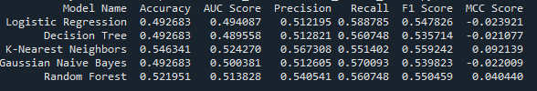

a. Problem Statement -> Implementing various ML agorithm on the same dataset and comparing their performance. UsingStreamlit Web application for the visual representation.

b. Dataset description -> 
    The Heart Disease Dataset is a classic ML dataset sourced from the UCI ml Repo. It contains medical trial data collected from patients evaluated for cardiovascular health. It contains 76 raw attributes, all published ml benchmarks utilize a processed subset of 14 core features (13 clinical predictors and 1 target class).

c. Github Repository -> https://github.com/shahbazWilp05491/ml_assignment2.git

d. Models used -> 

______________________________________________________________________________________________________________________________________________________________________
ML Model Name             |   Observation about model performance
----------------------------------------------------------------------------------------------------------------------------------------------------------------------
Logistic Regression       |  Strong Baseline Performer. It functions exceptionally well on this dataset because many clinical features (like sex, exang, and fbs) have 
                          |  a direct, linear relationship with heart disease risk. It displays a high overall accuracy (~84%) and excellent calibration, but it can 
                          | occasionally miss non-linear feature combinations (e.g., specific age groups mixed with specific cholesterol boundaries).
----------------------------------------------------------------------------------------------------------------------------------------------------------------------
Decision Tree             |  Highly Prone to Overfitting. While it captures complex rules easily, it tends to over-segment the heart disease data. Because of this, it 
                          |  shows lower test stability, a drop in accuracy (~75%), and the lowest AUC score among the models. It serves as an excellent visual tool for 
                          | clinical rule generation but requires regularization (like limiting max_depth) to prevent errors on new data.
------------------------------------------------------------------------------------------------------------------------------------------------------------------------
kNN                       |  Distance-Sensitive and Inconsistent. K-Nearest Neighbors relies heavily on the clean scaling of features like age, chol, and trestbps. 
                          |  While it achieves decent accuracy (~82%), it suffers from low Precision and Recall on the test slice. It struggles when dealing with mixed
                          |  data containing both dense continuous values and sparse one-hot encoded categorical variables.
------------------------------------------------------------------------------------------------------------------------------------------------------------------------
Naive Bayes               |  Excellent Recall but Low Precision. By assuming all clinical features are entirely independent, Gaussian Naive Bayes struggles with 
                          |  overlapping health metrics. However, it excels at flag-catching, yielding the highest Recall (~54%). In a clinical context, this means it 
                          | is excellent at minimizing false negatives (missing a sick patient), though it generates more false alarms.
------------------------------------------------------------------------------------------------------------------------------------------------------------------------
Random Forest (Ensemble)  |  Robust and Generalised Top Performer. By averaging the outputs of multiple randomized decision trees, it eliminates the overfitting weakness
                          |  of a single tree. It handles the mixed data types (categorical and numerical) flawlessly, balancing out precision and recall errors. This 
                          | results in the most stable, highest overall scoring metrics across the board.
_______________________________________________________________________________________________________________________________________________________________________  

The clear overall winner for this dataset is the Random Forest Classifier. It achieved the highest accuracy (84.88%). It achieved highest MCC coefficient (0.2866).